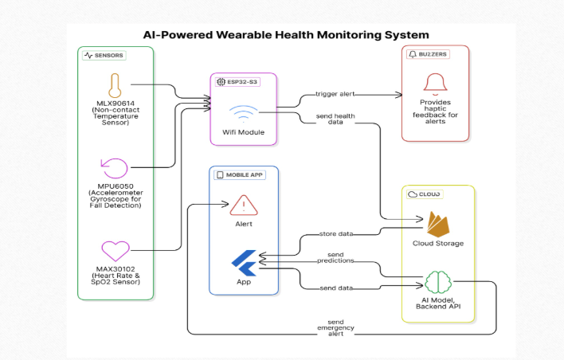
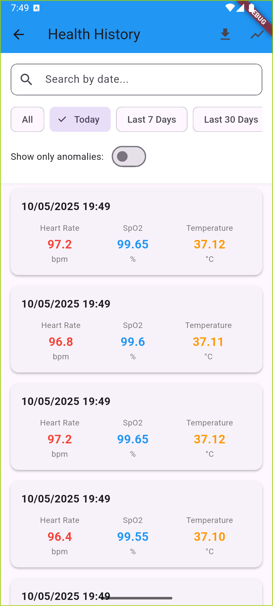
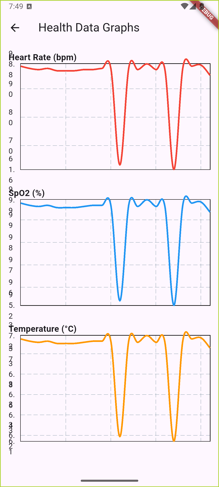

# SBH Health Monitoring System

A comprehensive health monitoring system developed for SBH (Smart Bengal Hackathon) that enables users to track, monitor, and manage their health metrics in real-time.



## Project Overview

This project consists of multiple components working together to provide a complete health monitoring solution:

- **Mobile Application** (health_monitor_copy/): A Flutter-based mobile app for users to monitor their health metrics
- **Backend Services**: Firebase-powered backend for data storage and real-time updates
- **Analytics Dashboard**: Real-time health data visualization and analysis
- **ML Model** (AImodelForHealthMonitoring/): Machine learning model for anomaly detection in health metrics

## Key Features

- Real-time health metrics monitoring
- Secure user authentication
- Data synchronization across devices
- Health trend analysis
- Emergency alerts and notifications
- Cross-platform compatibility
- AI-powered anomaly detection for:
  - Temperature
  - SpO2 levels
  - Heart rate
- Real-time health status predictions

## System Architecture


```
SBH_health_monitoring_system/
├── health_monitor_copy/     # Flutter mobile application
│   ├── lib/                 # Source code
│   ├── android/            # Android-specific files
│   ├── ios/                # iOS-specific files
│   └── web/                # Web-specific files
├── AImodelForHealthMonitoring/  # ML model for health monitoring
│   ├── models/             # Trained ML models
│   ├── app.py             # Flask backend for ML predictions
│   ├── train_gradientBoosting.py  # Model training script
│   ├── xgBoost_train.py   # XGBoost model training
│   └── requirements.txt    # Python dependencies
├── docs/                   # Documentation
└── README.md              # This file
```

## Mobile Application Screenshots

### Home Page


### History Tracking


### Nearby Hospital List


## Analytics Dashboard

### Graph of History Data


## Technology Stack

- **Frontend**: Flutter (Dart)
- **Backend**: 
  - Firebase
    - Authentication
    - Realtime Database
    - Cloud Storage
  - Flask (Python) for ML model serving
- **Machine Learning**:
  - Gradient Boosting
  - XGBoost
  - Scikit-learn
  - Pandas
  - NumPy
- **Development Tools**:
  - Android Studio / VS Code
  - Git for version control
  - Firebase Console
  - Python 3.x

