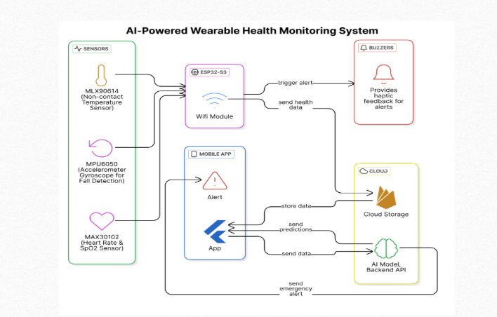
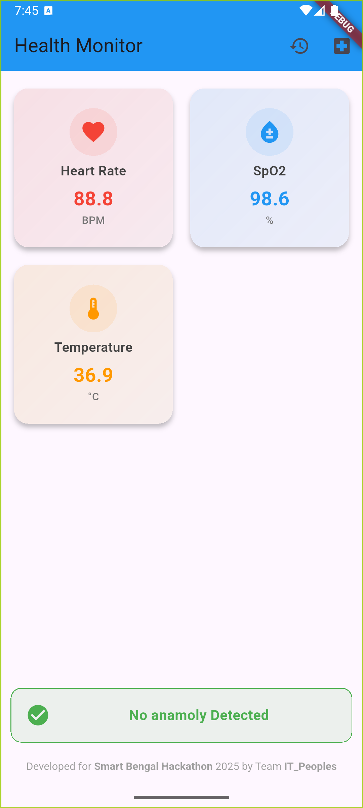
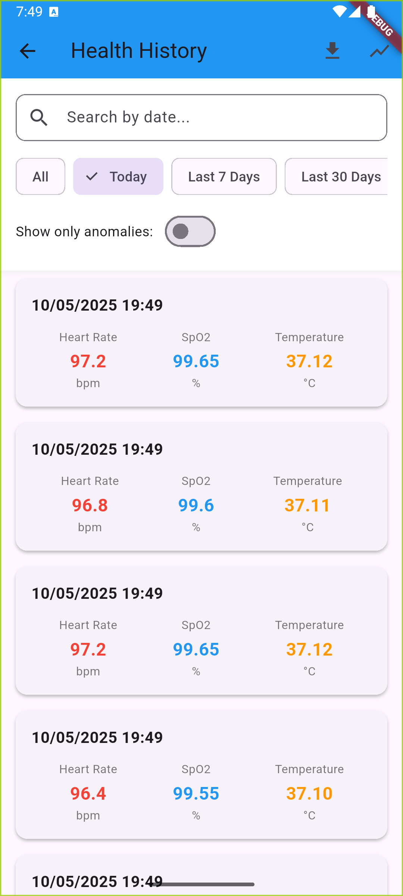
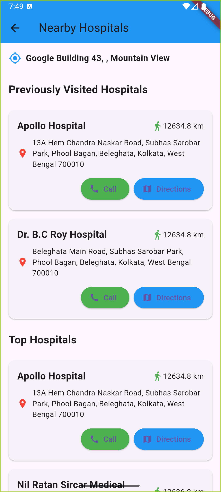
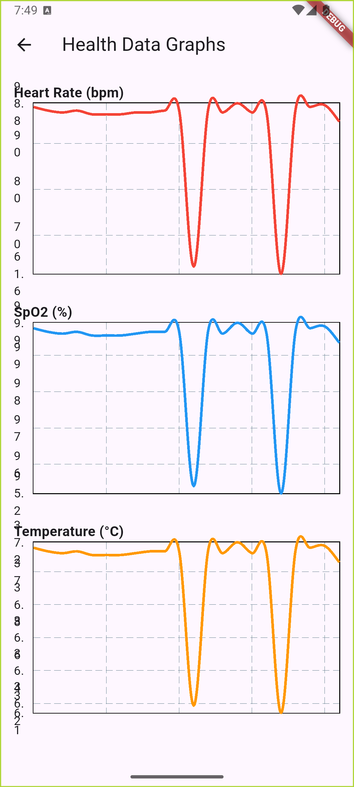

# SBH Health Monitoring System

A comprehensive health monitoring system developed for SBH (Smart Body Health) that enables users to track, monitor, and manage their health metrics in real-time.



## Project Overview

This project consists of multiple components working together to provide a complete health monitoring solution:

- **Mobile Application** (health_monitor_copy/): A Flutter-based mobile app for users to monitor their health metrics
- **Backend Services**: Firebase-powered backend for data storage and real-time updates
- **Analytics Dashboard**: Real-time health data visualization and analysis
- **ML Model** (AImodelForHealthMonitoring/): Machine learning model for anomaly detection in health metrics

## Key Features

- Real-time health metrics monitoring
- Secure user authentication
- Data synchronization across devices
- Health trend analysis
- Emergency alerts and notifications
- Cross-platform compatibility
- AI-powered anomaly detection for:
  - Temperature
  - SpO2 levels
  - Heart rate
- Real-time health status predictions

## System Architecture


```
SBH_health_monitoring_system/
├── health_monitor_copy/     # Flutter mobile application
│   ├── lib/                 # Source code
│   ├── android/            # Android-specific files
│   ├── ios/                # iOS-specific files
│   └── web/                # Web-specific files
├── AImodelForHealthMonitoring/  # ML model for health monitoring
│   ├── models/             # Trained ML models
│   ├── app.py             # Flask backend for ML predictions
│   ├── train_gradientBoosting.py  # Model training script
│   ├── xgBoost_train.py   # XGBoost model training
│   └── requirements.txt    # Python dependencies
├── docs/                   # Documentation
└── README.md              # This file
```

## Mobile Application Screenshots

### Home Page


### History Tracking


### Nearby Hospital List


## Analytics Dashboard

### Graph of History Data


## Technology Stack

- **Frontend**: Flutter (Dart)
- **Backend**: 
  - Firebase
    - Authentication
    - Realtime Database
    - Cloud Storage
  - Flask (Python) for ML model serving
- **Machine Learning**:
  - Gradient Boosting
  - XGBoost
  - Scikit-learn
  - Pandas
  - NumPy
- **Development Tools**:
  - Android Studio / VS Code
  - Git for version control
  - Firebase Console
  - Python 3.x

## Getting Started

1. Clone the repository:
```bash
git clone https://github.com/yourusername/SBH_health_monitoring_system.git
```

2. Set up the mobile application:
```bash
cd health_monitor_copy
flutter pub get
```

3. Set up the ML model:
```bash
cd AImodelForHealthMonitoring
pip install -r requirements.txt
python app.py
```

## Development Guidelines

- Follow Flutter best practices and coding standards
- Maintain proper documentation
- Write unit tests for critical functionality
- Use proper error handling and logging
- Follow security best practices for handling sensitive health data
- Ensure ML model versioning and documentation
- Regular model retraining and validation

## Security Considerations

- All health data is encrypted in transit and at rest
- Firebase security rules are properly configured
- Regular security audits and updates
- HIPAA compliance considerations for health data
- Secure API key management
- ML model input validation and sanitization
- Secure model serving endpoints

## Contributing

1. Fork the repository
2. Create a feature branch
3. Commit your changes
4. Push to the branch
5. Create a Pull Request

## License

This project is licensed under the MIT License - see the LICENSE file for details

## Support

For support, please contact:
- Email: [support@sbhhealth.com]
- Issue Tracker: [GitHub Issues]

## Acknowledgments

- Flutter Team
- Firebase Team
- Scikit-learn and XGBoost Teams
- All contributors to the project

## Roadmap

- [ ] Enhanced data visualization
- [ ] Additional ML model features
- [ ] Integration with wearable devices
- [ ] Advanced analytics dashboard
- [ ] Multi-language support
- [ ] Model performance optimization
- [ ] Real-time model updates
- [ ] Additional health metrics monitoring 